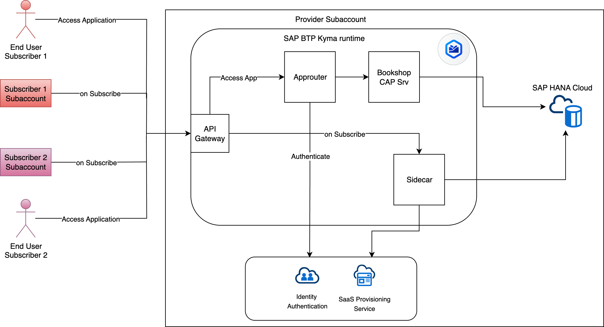

# Overview



A simple end-to-end sample to demonstrate building and deploying a multitenant CAP application to Kyma.

## Prerequisites

- [SAP BTP, Kyma runtime instance](../prerequisites/README.md#kyma)

> [!Note]
> If you're using an SAP BTP trial account, use a subaccount that supports SAP Hana Cloud. At the time of creating the sample (September 2025), SAP Hana Cloud is available in the US, but not in Singapore.

- [Docker](../prerequisites/README.md#docker)
- [Kubernetes tooling](../prerequisites/README.md#kubernetes)
- kubectl configured to the namespace where you want to deploy the application
- [Pack](../prerequisites/README.md#pack)
- [NodeJS 22 or higher](https://nodejs.org/en/download/)
- [SAP CAP](../prerequisites/README.md#sap-cap)
- SAP Hana Cloud instance

> [!Note]
> If you're using an SAP BTP trial account, make sure your subaccount location supports SAP Hana Cloud.

- Entitlement for `hdi-shared` plan for SAP Hana Cloud in your SAP BTP subaccount
- [SAP Hana Cloud instance mapped to Kyma](https://blogs.sap.com/2022/12/15/consuming-sap-hana-cloud-from-the-kyma-environment/)

- [curl](https://curl.se/)

## Procedure

- Delete the existing `bookshop-external` directory if you have cloned the repo.

- Initialize the project

    ```shell
    cds init bookshop-external --add tiny-sample,nodejs,multitenancy
    ```

- **Navigate to bookshop-external directory**.

> [!Note]
> All subsequent commands should be run from this directory.

  ```shell
  cd bookshop-external
  ```

1. Add sqlite

    ```shell
    cds add sqlite --for development
    ```

2. For local testing, create a new profile that contains the multitenancy configuration:

    ```shell
    cds add multitenancy --for local-multitenancy
    ```

3. Enable xsuaa, hana

    ```shell
    cds add xsuaa,hana --for production
    ```

4. For cds build

    ```shell
    npm install
    cds build --production
    ```

5. Start a sidecar.

    ```shell
    cds watch mtx/sidecar
    ```

6. In another terminal, start the CAP application.

    ```shell
    cds watch --profile local-multitenancy
    ```

7. Add tenants. Run the following commands in a new terminal or use [test.rest](./test.rest).

    ```shell
    cds subscribe t1 --to http://localhost:4005 -u yves:
    cds subscribe t2 --to http://localhost:4005 -u yves:
    ```

7. Get data for both users

  ```shell
  curl -u alice: http://localhost:4004/odata/v4/catalog/Books
  curl -u erin: http://localhost:4004/odata/v4/catalog/Books
  ```

### Approuter

1. Add approuter

    ```shell
    cds add approuter --for production
    ```

2. Update the [bookshop-external/app/router/xs-app.json](bookshop-external/app/router/xs-app.json) to add a default route for the app router. This is required to access the CAP application via the URL. The end json should look as below:

    ```json
    {
        "welcomeFile": "/odata/v4/catalog/Books",
        //rest of the configuration
    }
    ```

## Deploy to Kyma

### Build docker images

1. Add helm and containerize

    ```shell
    cds add helm,containerize
    ```

2. Build and deploy the helm chart to Kyma

    ```bash
    cds build --production
    cds up -2 k8s
    ```

## Verify

1. Simulate the subscribe flow by subscribing from a different subaccount in the same global account in SAP BTP cockpit.

2. Access the subscribed application.

### Clean Up

1. Unsubscribe the tenant from SAP BTP cockpit.
2. Undeploy the Helm chart.

  ```bash
  helm del --wait --timeout=10m bookshop-external
  ```

## Troubleshooting

Use Helm commands to upgrade/install/reinstall the chart. For example:

  ```bash
  helm upgrade --install bookshop-external ./gen/chart  --wait --wait-for-jobs --timeout=10m --set-file xsuaa.jsonParameters=xs-security.json
  ```

## Related Information

- [CAP Documentation](https://cap.cloud.sap/docs/get-started/)
- [CAP Multitenancy](https://cap.cloud.sap/docs/guides/multitenancy/)
- [Deploy to Kyma](https://cap.cloud.sap/docs/guides/deployment/to-kyma)
