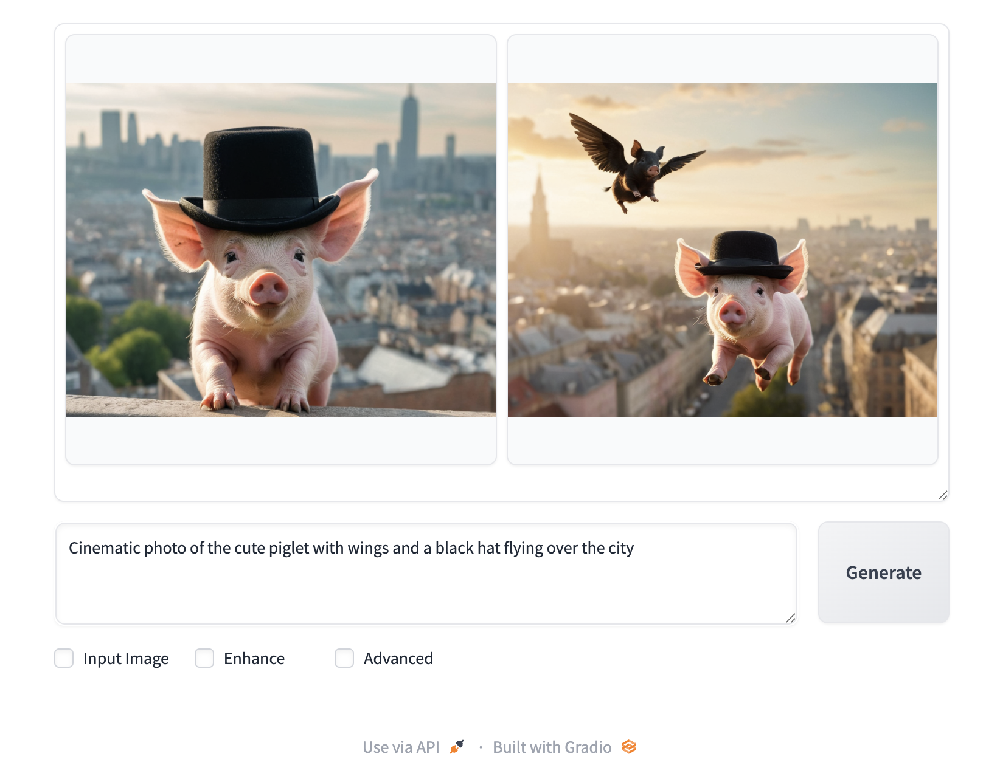

# Running GPU Workload in a Kyma Cluster

> [!Note]
> This sample is based on [NVIDIA GPU Operator Installation Guide for Gardener](https://github.com/gardener/gardener-ai-conformance/blob/main/v1.33/NVIDIA-GPU-Operator.md).

## Prerequisites

- Helm 3.x installed. For more information, see the [Kubernetes](https://github.com/SAP-samples/kyma-runtime-samples/tree/main/prerequisites#kubernetes) section.
- kubectl installed and configured to access your Kyma cluster. For more information, see the [Kubernetes](https://github.com/SAP-samples/kyma-runtime-samples/tree/main/prerequisites#kubernetes) section.
- You have an SAP BTP, Kyma runtime instance.

## Procedure

### Setting Up a GPU Worker Pool

Follor these step, to set up a worker pool with GPU nodes available in your Kyma cluster. For more information, see [Additional Worker Node Pools](https://help.sap.com/docs/btp/sap-business-technology-platform/provisioning-and-update-parameters-in-kyma-environment?version=Cloud#additional-worker-node-pools).

1. Go to the SAP BTP cockpit and update your Kyma instance by adding a new worker pool named `gpu`.
2. Add some nodes with the GPU support, for example, `g6.xlarge`.
3. Set auto-scaling min nodes to `0` and max nodes to a desired number, for example, `2`. This way, when no GPU workloads are running, the cluster scales down to zero GPU nodes, saving costs.

### Installation

1. Add the NVIDIA Helm repository.

   ```bash
   # Add the NVIDIA Helm repository
   helm repo add nvidia https://helm.ngc.nvidia.com/nvidia

   # Update repository information
   helm repo update

   # Verify repository is added
   helm search repo nvidia/gpu-operator
   ```

2. Install the GPU operator with Garden Linux configuration.

   The key to successful installation on Garden Linux is using the specialized values file that handles the Garden Linux-specific requirements.

   ```bash
   # Install GPU Operator with Garden Linux optimized values
   helm upgrade --install --create-namespace -n gpu-operator gpu-operator nvidia/gpu-operator --values \
   https://raw.githubusercontent.com/SAP-samples/kyma-runtime-samples/refs/heads/main/gpu/gpu-operator-values.yaml

   # Wait for installation to complete
   helm status gpu-operator -n gpu-operator
   ```

> [!Note]
> The [gpu-operator-values.yaml](gpu-operator-values.yaml) file is configured for driver version 570, which is compatible with current Garden Linux kernel versions in Kyma clusters. If you need a different driver version, adjust the `driver.version` field in the values file accordingly (download the file and modify it locally before installation).

3. The GPU operator deploys several components as DaemonSets and Deployments. Monitor the installation.

   ```bash
   # Watch all pods in gpu-operator namespace
   kubectl get pods -n gpu-operator -w

   # Check deployment status
   kubectl get all -n gpu-operator
   ```

### Installation Verification

1. Deploy a simple GPU test workload.

   ```bash
   # Create test GPU workload
   cat <<EOF | kubectl apply -f -
   apiVersion: v1
   kind: Pod
   metadata:
     name: gpu-test
   spec:
     containers:
     - name: gpu-test
       image: nvcr.io/nvidia/cuda:13.0.1-runtime-ubuntu24.04
       command: ["nvidia-smi"]
       resources:
         limits:
           nvidia.com/gpu: 1
     restartPolicy: Never
   EOF
   ```

   If your cluster does not have GPU resources available, the Pod remains in the `Pending` state for a while until a GPU node is provisioned.

   Once the node is up, the NVIDIA GPU Operator deploys the device plugin DaemonSet, which then advertises `nvidia.com/gpu` resources on that node.

2. Check the autoscaler config to see if GPU nodes are being considered.

   ```bash
   kubectl get configmap -n kube-system cluster-autoscaler-status -o yaml
   ```

   This is an example section from the ConfigMap showing a GPU worker pool with one node started:
 
   ```yaml
       - name: shoot--kyma--c-1f226cf-gpu-z1
         health:
           status: Healthy
           nodeCounts:
             registered:
               total: 1
               ready: 1
               notStarted: 0
             longUnregistered: 0
             unregistered: 0
           cloudProviderTarget: 1
           minSize: 0
           maxSize: 3
           lastProbeTime: "2025-12-11T14:40:54.65491129Z"
           lastTransitionTime: "2025-12-11T02:13:08.790764467Z"
         scaleUp:
           status: NoActivity
           lastProbeTime: "2025-12-11T14:40:54.65491129Z"
           lastTransitionTime: "2025-12-11T12:12:13.016415154Z"
         scaleDown:
           status: NoCandidates
           lastProbeTime: "2025-12-11T14:40:54.65491129Z"
           lastTransitionTime: "2025-12-11T13:10:13.472558018Z"
   ```

3. Observe this config map to see if the GPU worker pool is recognized and nodes are being provisioned as needed. When the GPU node is ready, the `nvidia.com/gpu` resource should be available for scheduling, and the test Pod should complete successfully.

   You can run these commands to monitor the test Pod, check logs, and clean up afterward:

   ```bash
   # Wait for pod to complete and check output
   kubectl wait --for=jsonpath='{.status.phase}'=Succeeded pod/gpu-test --timeout=300s
   kubectl logs gpu-test

   # Clean up test pod
   kubectl delete pod gpu-test
   ```

### More Spectacular GPU Demo - AI Image Generation

For a more impressive demonstration that showcases real GPU acceleration, follow these steps:

1. Deploy an AI image generation workload using fooocus and the Stable Diffusion XL model.

   ```bash
   kubectl apply -f https://raw.githubusercontent.com/SAP-samples/kyma-runtime-samples/main/gpu/fooocus.yaml
   ```

   The web UI is exposed using an APIRule, and you can access it via browser using your cluster domain and fooocus subdomain, for example, `https://fooocus.xxxxxxxx.kyma.ondemand.com/`. 

   

2. To delete the demo app, run:

   ```bash
   kubectl delete -f https://raw.githubusercontent.com/SAP-samples/kyma-runtime-samples/main/gpu/fooocus.yaml
   ```

### Cleanup

If you delete all the Pods that require GPU, your worker pool should be scaled down to zero nodes again, saving costs. You can check if cluster autoscaler recognizes that there are no GPU nodes needed by checking the cluster-autoscaler-status ConfigMap.

```bash
kubectl get configmap -n kube-system cluster-autoscaler-status -o yaml
```

You should see candidates for scaling down in the GPU worker pool section. Bear in mind that scaling down takes 60 minutes (this is the Kyma cluster default setting). 
