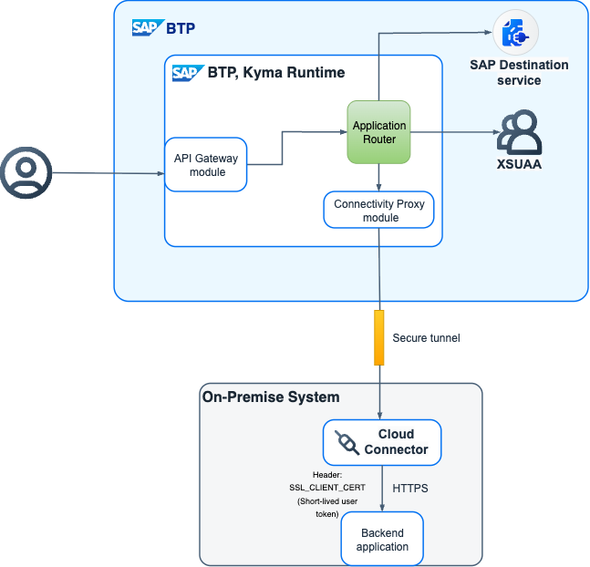
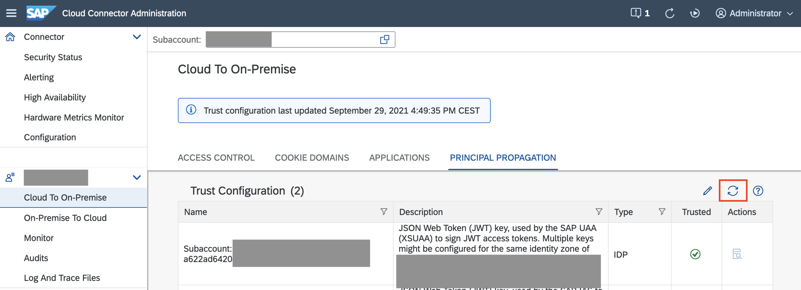
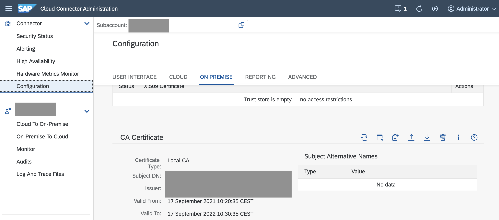
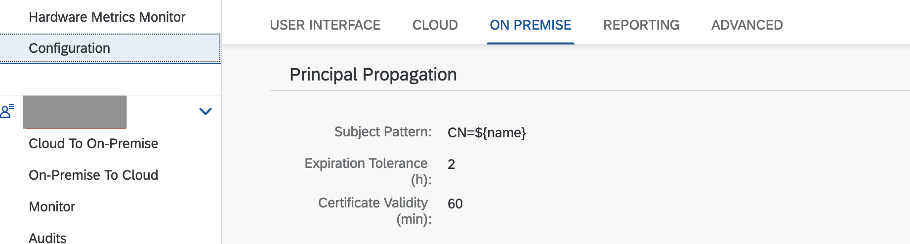
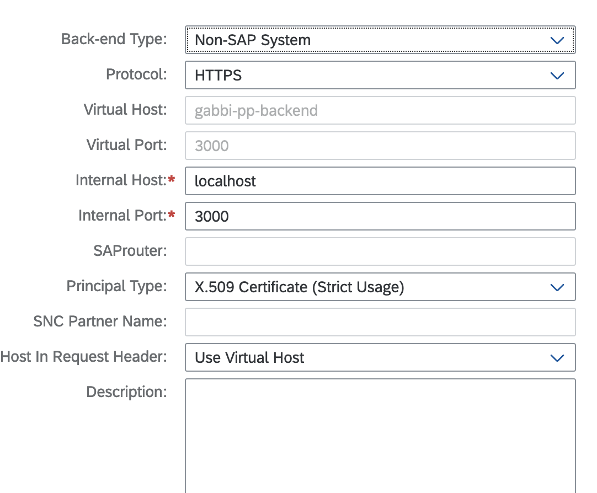
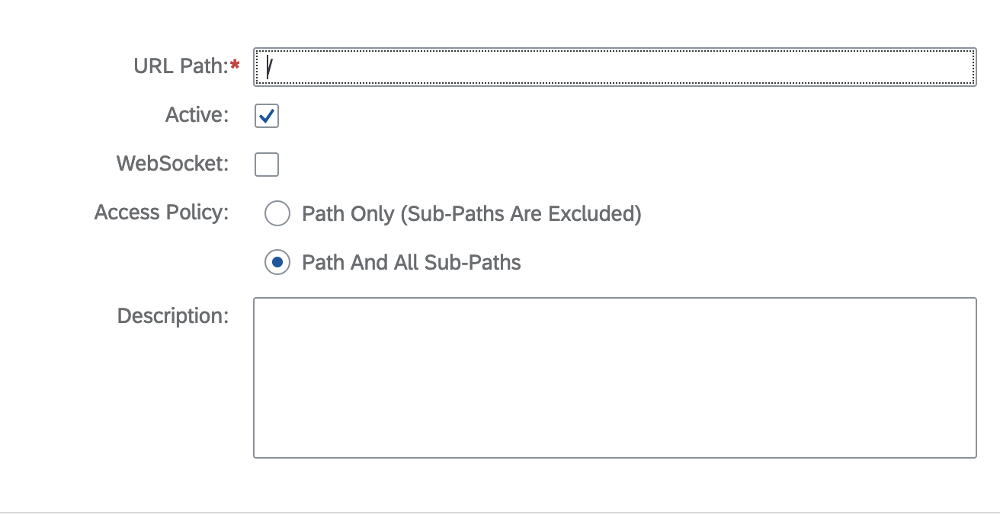
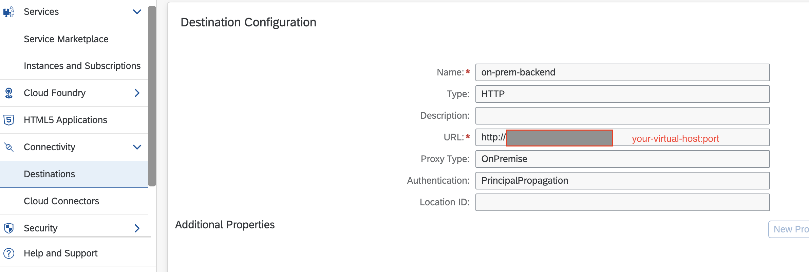

# Configuring Principal Propagation to an On-Premise System

This sample provides details on how to configure principal propagation when you extend an on-premise system using SAP BTP, Kyma runtime.

## Context

The principal propagation relies on exchanging the JWT token received in Kyma. The exchanged token is then forwarded to the SAP Cloud Connector and is used to identify the logged-in user.

You can use either XSUAA or SAP Cloud Identity Services as an external identity provider with user federation.

The following diagram presents a flow in which a logged-in user fetches their sales data from the on-premise system. Using a standalone SAP application router, an API `sap/com/onprem/mysales` is hosted in the Kyma runtime. This API calls the on-premise system using the Connectivity Proxy module.



## Prerequisites

* [SAP BTP, Kyma runtime instance](../prerequisites/README.md#kyma)
* [Kubernetes tooling](../prerequisites/README.md#kubernetes)
* [Cloud Connector on your laptop or test system](../prerequisites/README.md#sap-cloud-connector)
* [Node.js](https://nodejs.org/en/download/) - the Node.js runtime, including the node package manager NPM. Install the **LTS** version.
* [OpenSSL](https://www.openssl.org/) or another similar tool to generate certificates

## Procedure

### Configuring the Cloud Connector

> ### Note:
> This section uses the official SAP BTP Connectivity service documentation on [Configuring Principal Propagation](https://help.sap.com/docs/CP_CONNECTIVITY/cca91383641e40ffbe03bdc78f00f681/c84d4d0b12d34890b334998185f49e88.html).

1. [Configure Trusted Entities in the Cloud Connector](https://help.sap.com/docs/connectivity/sap-btp-connectivity-cf/set-up-trust-for-principal-propagation?version=Cloud#loioa4ee70f0274248f8bbc7594179ef948d__configure_trust).
   > ### Note: 
   > Make sure you synchronize the list with your Cloud Connector by using the **Synchronize** button.
   > 

2. [Configure a CA Certificate](https://help.sap.com/docs/CP_CONNECTIVITY/cca91383641e40ffbe03bdc78f00f681/d0c4d5675d4f4bc78a5b7a7b8687c841.html) for principal propagation. Use Option 3 (as of version 2.10): Generate a self-signed certificate from the [Install a local CA Certificate](https://help.sap.com/docs/connectivity/sap-btp-connectivity-cf/configure-ca-certificate-for-principal-propagation?version=Cloud#install-a-local-ca-certificate) section.

    

3. Ensure that for Principal Propagation, the **Subject Pattern** is `CN=${name}`.
     
   

4. [Install a System Certificate for Mutual Authentication](https://help.sap.com/docs/CP_CONNECTIVITY/cca91383641e40ffbe03bdc78f00f681/3f974eae3cba4dafa274ec59f69daba6.html). Use the third option - generating a self-signed certificate.

### Configuring the On-Premise System

You can run the on-premise system on your laptop or in a test system. For simplicity, use the same system where your SAP Cloud Connector is running.

1. Download the CA certificate from the Cloud Connector under the `certs` directory as `ca_cert.der`.

2. Convert the CA certificate to the `PEM` format.

   ```shell script
   openssl x509 -inform der -in certs/ca_cert.der -out certs/ca_cert.pem
   ```

3. Generate self-signed server key and certificate

   ```shell script
   # Generate a key file
   openssl genrsa -out certs/server_key.pem

   # Generate a Certificate Signing Request
   openssl req -new -key certs/server_key.pem -out certs/server_csr.pem

   # Generate the certificate by signing it with the key
   openssl x509 -req -days 9999 -in certs/server_csr.pem -signkey certs/server_key.pem -out certs/server_cert.pem
   ```

4. Update the mock sales data in [on-prem-backend/sales.json](on-prem-backend/sales.json) to provide your `{logged-in-user-email}`.

5. Run the application locally.

   ```shell script
   # go to the nodejs project
   cd on-prem-backend

   # install dependencies if not done earlier
   npm install

   # start the application locally
   HTTPS=true && npm start
   ```

6. Configure the on-premise backend in the Cloud Connector as a virtual host.

   

7. Configure the resources to **Path And All Sub-Paths**.
   
   

### Configuring the Kyma Runtime

1. Set up environment variables.

   ```shell script
   export NS={your-namespace}
   # only required once to enable Istio sidecar. Ignore if done already
   kubectl label namespaces $NS istio-injection=enabled
   ```

2. Enable the Connectivity Proxy module in the Kyma runtime. For more information, see [Kyma Modules](https://help.sap.com/docs/btp/sap-business-technology-platform/kyma-modules) and [Adding and Deleting a Kyma Module](https://help.sap.com/docs/btp/sap-business-technology-platform/enable-and-disable-kyma-module).

3. Create a Destination Configuration in the SAP BTP cockpit.
  

4. Create an XSUAA instance. Update the [app-router/k8s/xsuaa-instance.yaml](app-router/k8s/xsuaa-instance.yaml) to provide `{your-cluster-domain}`.

   ```shell script
   kubectl -n $NS apply -f app-router/k8s/xsuaa-instance.yaml
   ```

5. Create a Destination Service instance.

   ```shell script
   kubectl -n $NS apply -f app-router/k8s/destination-instance.yaml
   ```

6. For the application router to automatically exchange the token using the destination configuration, it needs to be provided with the necessary credentials as well as the details of the Connectivity Proxy running inside the Kyma cluster.

   Create the ConfigMap containing connection details about Connectivity Proxy running inside kyma runtime.

   ```shell script
   kubectl -n $NS apply -f app-router/k8s/connectivity-proxy-info.yaml
   ```
7. Create the configuration required for the application router.

   ```shell script
   kubectl -n $NS apply -f app-router/k8s/config.yaml
   ```

8. Deploy the application router. Update the [app-router/k8s/deployment.yaml](app-router/k8s/deployment.yaml) to provide `{your-cluster-domain}`.

   ```shell script
   kubectl -n $NS apply -f app-router/k8s/deployment.yaml
   ```

9. Expose it over the internet using the APIRule resource.

   ```shell script
   kubectl -n $NS apply -f app-router/k8s/api-rule.yaml
   ```

## Testing

Access the sales data for the logged-in user by adjusting the URL: <https://principal-prop-on-prem.{your-cluster-domain}/sap/com/onprem/mysales>.

## Troubleshooting

* [Issues with connectivity-proxy/on-prem calls](../troubleshooting/README.md#on-premise-connectivity)
