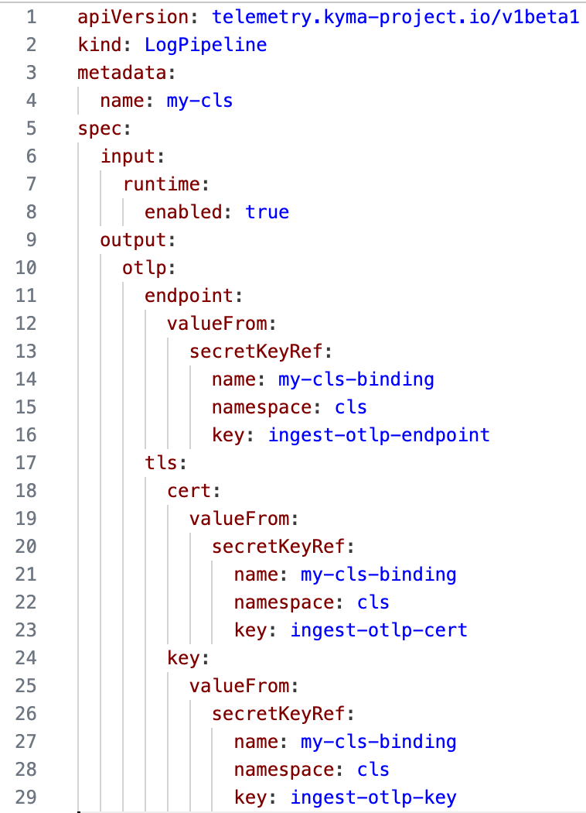
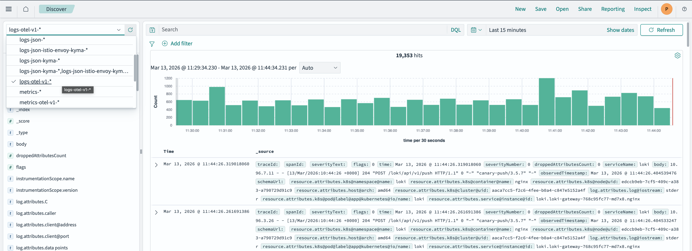

# Overview

Welcome to the first sample in our three-part series, where we will explore how Kyma can seamlessly integrate with the SAP Cloud Logging service. By enabling the three pillars of observability - logs, traces, and metrics - Kyma developers and operators can effectively troubleshoot issues, identify root causes, investigate performance bottlenecks, and gain a comprehensive understanding of system behavior.

This sample covers the following topics:

1. SAP Cloud Logging: An Overview
   - Learn about the SAP Cloud Logging service and its significance in the context of Kyma integration.
   - Discover how to provision an instance of SAP Cloud Logging.

2. Shipping Logs to SAP Cloud Logging
   - Explore the step-by-step process of shipping logs from applications deployed on SAP BTP, Kyma runtime to SAP Cloud Logging.

The subsequent samples cover the integration of traces and metrics.

## What is SAP Cloud Logging?

The SAP Discovery Center description says:

*SAP Cloud Logging service is an instance-based observability service that builds upon OpenSearch to store, visualize, and analyze application logs, metrics, and traces from SAP BTP Cloud Foundry, Kyma, Kubernetes, and other runtime environments.

For Cloud Foundry and Kyma, SAP Cloud Logging offers an easy integration by providing predefined content to investigate the load, latency, and error rates of the observed applications based on their requests and correlate them with additional data.*

To get started with SAP Cloud Logging, visit the [Discovery Center](https://discovery-center.cloud.sap/serviceCatalog/cloud-logging?service_plan=overall-(large,-standard,-and-dev)&region=all&commercialModel=cloud&tab=feature) where you will find more detailed information about its features and capabilities.

To estimate pricing, use the [SAP Cloud Logging Capacity Unit Estimator](https://sap-cloud-logging-estimator.cfapps.us10.hana.ondemand.com/). For Kyma, you must enable the **Ingest Otel** option, which is used for shipping traces and metrics.

## Provision an Instance of SAP Cloud Logging

Now, let's explore how we can use SAP Cloud Logging to ingest logs from applications deployed on SAP BTP, Kyma runtime.

### Prerequisites

- [SAP BTP, Kyma runtime instance](../prerequisites/README.md#kyma)
- [Kubernetes tooling](../prerequisites/README.md#kubernetes)
- Entitlement added for SAP Cloud Logging to the subaccount where Kyma is provisioned

### Procedure

For details, see [Create an SAP Cloud Logging Instance through SAP BTP Service Operator](https://help.sap.com/docs/cloud-logging/cloud-logging/create-sap-cloud-logging-instance-through-sap-btp-service-operator?version=Cloud).

1. Export your namespace name as an environment variable:

   ```shell
   # In the instructions, all resources are created in cls namespace. If you want to use a different namespace, adjust the files appropriately
   export NS=cls
   kubectl create ns ${NS}
   ```

2. To provision an instance of SAP Cloud Logging, create a service instance and a service binding:

    ```shell
    kubectl -n ${NS} apply -f ./k8s/cls-instance.yaml
    ```

    For reference, this is the service instance specification:

    ```yaml
    apiVersion: services.cloud.sap.com/v1
    kind: ServiceInstance
    metadata:
        name: my-cls
    spec:
        serviceOfferingName: cloud-logging
        servicePlanName: dev
        parameters:
          retentionPeriod: 7
          esApiEnabled: false
          ingest_otlp:
            enabled: true
    ```

    This is the corresponding service binding.

    ```yaml
    apiVersion: services.cloud.sap.com/v1
    kind: ServiceBinding
    metadata:
        name: my-cls-binding
    spec:
      serviceInstanceName: my-cls
      credentialsRotationPolicy:
        enabled: true
        rotationFrequency: "720h"
        rotatedBindingTTL: "24h"
    ```

    The service binding specifies the credentials rotation policy. The Telemetry module automatically switches to new credentials after they are rotated, which requires no action from you.

    > **NOTE:** You reuse this same instance to configure tracing and monitoring in the subsequent tutorials.

    The service binding also generates a Secret with the same name. It contains the details to access the dashboard of the SAP Cloud Logging instance previously created.

    

## Ship your application logs to SAP Cloud Logging

To ship your logs to SAP Cloud Logging, create LogPipeline custom resources (CRs).

Your application running in SAP BTP, Kyma runtime sends logs to stdout. Based on the LogPipeline, the Telemetry module captures and ships them to SAP Cloud Logging.

### Create a LogPipeline CR for Your Application Logs

To create the LogPipeline, run:

```shell
kubectl apply -f ./k8s/logging/logs-pipeline.yaml
```

In the LogPipeline, you configure how logs are shipped to SAP Cloud Logging with the following options:

- Input: Specifies the applications, containers, and namespaces from which logs are shipped
- Output: Contains the access details of the SAP Cloud Logging instance to which logs are shipped.

You can learn about all the parameters in detail from the official Telemetry [LogPipeline](https://kyma-project.io/#/telemetry-manager/user/resources/02-logpipeline?id=custom-resource-parameters) documentation.

This is an example of the LogPipeline configuration used for this sample:



### Enable Istio Access logs

For details, see [Configure Istio Access Logs](https://kyma-project.io/external-content/telemetry-manager/docs/user/collecting-logs/istio-support.html).

Istio access logs provide fine-grained details about traffic to workloads in the Istio service mesh, related to the four golden signals (latency, traffic, errors, and saturation) and help troubleshoot anomalies. Before you enable Istio access logs, enable Istio sidecar injection for your workloads.

For details, see [Enable Istio Logs for the Entire Mesh](https://kyma-project.io/external-content/telemetry-manager/docs/user/collecting-logs/istio-support.html#enable-istio-logs-for-the-entire-mesh).

```shell
kubectl apply -f ./k8s/tracing/trace-istio-telemetry.yaml
```

> **NOTE:** This and the subsequent samples use the same Istio Telemetry configuration for tracing and logging.

## View the logs

To access the SAP Cloud Logging dashboard, use the credentials from the Secret generated by the service binding.


The simplest way to start exploring the logs is to navigate to **Discover** and choose the appropriate index.


You can choose an index pattern to view relevant logs, apply a filter or search term to narrow down results, or use other OpenSearch capabilities.



While metrics are covered in a later sample, note the **Four Golden Signals** dashboard. SAP Cloud Logging provides this dashboard out-of-the-box, based on the Istio access logs that you configured previously.

For reference, check out the generic and latency dashboards.


Now you can start exploring your application as well as the access logs.

Stay tuned for the next samples about shipping traces from SAP BTP, Kyma runtime to SAP Cloud Logging.
